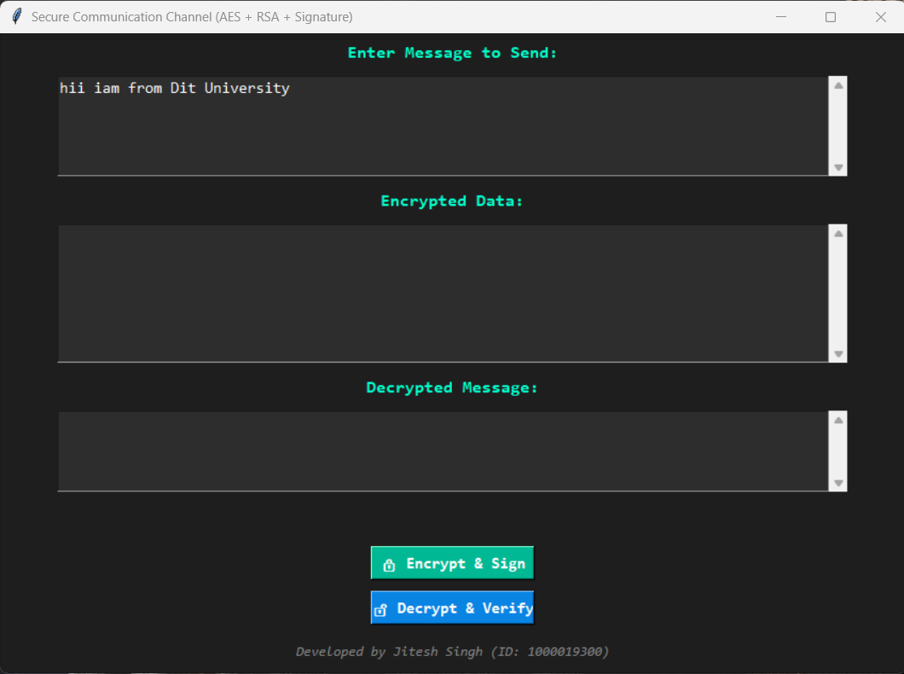
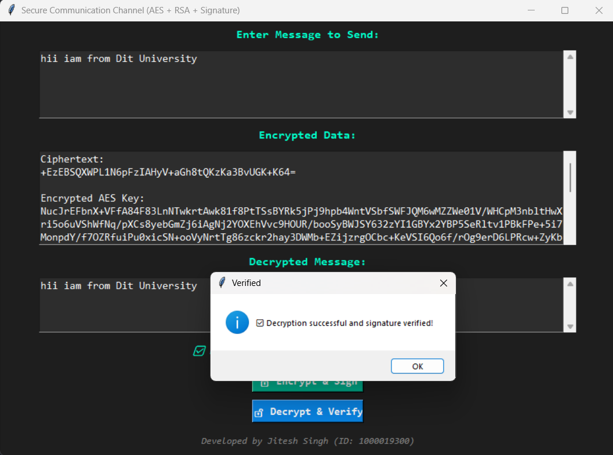

# 🔐 Secure Communication Channel using Hybrid Cryptography (AES + RSA + SHA256)

## 📘 Overview
This project implements a **hybrid cryptography system** combining:
- **AES** for fast symmetric encryption
- **RSA** for secure key exchange
- **SHA-256 digital signatures** for integrity and authentication

It demonstrates the **CIA Triad** — Confidentiality, Integrity, and Authentication — through a user-friendly GUI built in Python using Tkinter.

---

## ⚙️ Features
✅ AES encryption for message confidentiality  
✅ RSA key exchange for secure key transfer  
✅ SHA-256 digital signature for integrity & authentication  
✅ Tkinter GUI for encryption/decryption operations  
✅ Real-time verification of message authenticity

---

## 🧠 Working
1. The sender enters a plaintext message.  
2. Message is encrypted using AES with a random key.  
3. The AES key is encrypted using the receiver’s RSA public key.  
4. A SHA-256 hash of the message is created and signed with sender’s private key.  
5. The receiver decrypts and verifies the message, ensuring authenticity.

---

## 🖥️ Tech Stack
- **Language:** Python  
- **Libraries:** cryptography, tkinter  
- **IDE:** VS Code  

---

## 📸 Screenshots

---

## 🎓 Developed By
**Jitesh Singh**  
B.Tech CSE, DIT University  
ID: 1000019300
